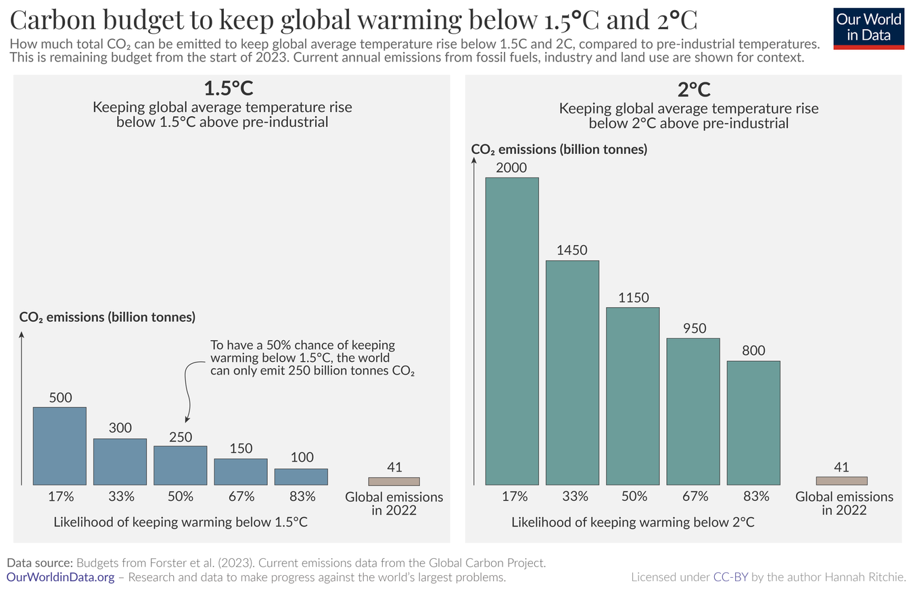

```{r setup, include=FALSE}
knitr::opts_chunk$set(echo = F, warning=F, message=F)

library("tidyverse")
library("ggplot2")
library("ggpubr")
## https://github.com/vincentarelbundock/WDI
## install.packages('WDI')
## library('WDI')
library('knitr')

```

## Problem

W Porozumieniu paryskim (2015) postawiono za cel utrzymanie wzrostu średniej temperatury na świecie 
znacznie poniżej 2°C, a docelowo do 1,5°C względem epoki przedprzemysłowej.

**Globalny budżet węglowy** (global carbon budget),
to ilość CO², która wyemitowana do atmosfery nie podwyższy
temperatury wyżej niż owe magiczne 1,5/2,0°C. 

GBW da się określić z pewnym prawdopodobieństwem. Im wyższa pewność
tym niższa ilość CO², którą można przepalić
(https://ourworldindata.org/how-much-co2-can-the-world-emit-while-keeping-warming-below-15c-and-2c)

{width=90%}

(83% szansa to tak mniej więcj wyrzucić 3 razy pod rząd orła)


## Wzrost


Wzrost gospodarczy to proces, w którym następuje zwiększenie produkcji dóbr i usług. 

Suma wartości wszystkich dóbr i usług finalnych wytworzonych w danym kraju 
to dochód narodowy vel produkt krajowy (PKB).

https://en.wikipedia.org/wiki/Green_growth

```{r}
wdi.indicators <- c(
  'NY.GDP.PCAP.CD',    ## GDP per capita (current US$)
  'NY.GDP.PCAP.KD',    ## GDP per capita (constant 2015 US$)
  'NY.GDP.PCAP.PP.KD', ## GDP per capita, PPP (constant 2017 international $)
  ##
  'NV.AGR.TOTL.KD', ##  Agriculture, forestry, and fishing, value added
  'NV.AGR.TOTL.ZS', ##  NV.AGR.TOTL.ZS VA %GDP
  ##
  ## NV.IND.MANF.CD
  'NV.IND.MANF.KD', ##  Manufacturing, value added (constant 2015 US$)
  'NV.IND.MANF.ZS', ##  Manufacturing, value added (% of GDP)
  ##
  'EN.ATM.CO2E.KT', ## CO2 emissions (metric tons)
  'EN.ATM.CO2E.PC', ## CO2 emissions (metric tons per capita)
  'SP.POP.TOTL',    ## Population, total
  ##
  ##https://data.worldbank.org/indicator/EN.ATM.CO2E.KD.GD
  'EN.ATM.CO2E.KD.GD', ## CO2 emissions (kg per 2015 US$ of GDP)
  'EN.ATM.CO2E.PP.GD', ## CO2 emissions (kg per PPP $ of GDP)
  ## Energy intensity
  'EG.EGY.PRIM.PP.KD'
)


year.start <- 1990

## GDP/Constant prices
#f0 <- WDI(wdi.indicators, country = "all", start=year.start)
##
##
## write.table(f0, file='kuznets-indicators.csv', sep = ';', row.names = F)
##
f00 <- read.csv('kuznets-indicators.csv', sep = ';')

gcb0  <- read.csv("GCB2023v28_MtCO2_flat.csv") %>%  
  select(country=Country, iso3=`ISO.3166.1.alpha.3`, year=Year, emission.gcb=Total) %>%
  filter (iso3 != '' & iso3 != 'KNA') %>%
  filter (year > 1990)

gcb2  <- read.csv("GCB_territorial.csv", sep = ';', dec=',') %>%  
  #select(country=Country, iso3=`ISO.3166.1.alpha.3`, year=Year, emission.gcb=Total) %>%
  #filter (iso3 != '' & iso3 != 'KNA') %>%
  pivot_longer(names_to = 'country', values_to='value',  cols =-(year)) %>%
  filter (year > 1990) %>%
  arrange (country) %>%
  mutate (tvalue = 3.664 * as.numeric(value),
          country = gsub('\\.', ' ', country)) %>%
  select (-value)

gcb1  <- read.csv("GCB_consumption.csv", sep = ';', dec = ',',  na.string = '') %>%  
  pivot_longer(names_to = 'country', values_to='value',  cols =-(year)) %>%
  filter (year > 1990) %>%
  arrange (country) %>%
  mutate (cvalue = 3.664 * as.numeric(value),
          country = gsub('\\.', ' ', country)) %>%
  select (-value)

gcb <- gcb0 %>%
  left_join(gcb1, by=c('country', 'year'))  %>%
  left_join(gcb2, by=c('country', 'year')) 

f0 <- f00 %>%
  left_join(gcb, by=c('iso3c'='iso3', 'year'='year')) 

## https://rpubs.com/blscottnz/data_cleaning_and_viz
## https://datacarpentry.org/shell-economics/03-working-with-files/

f1 <- f0 %>%
  select ( iso3c, 
           year, 
           country=country.x,
           gdpcp=NY.GDP.PCAP.CD,
           gdp=NY.GDP.PCAP.KD,
           gdppp=NY.GDP.PCAP.PP.KD,
           agro=NV.AGR.TOTL.KD,
           agrop=NV.AGR.TOTL.ZS,
           manuf=NV.IND.MANF.KD,
           manufp=NV.IND.MANF.ZS, 
           emission.wb=EN.ATM.CO2E.KT, ## total emission
           #co=EN.ATM.CO2E.PC,
           emission.gcb,  
           emissionc=cvalue,
           intensity=EN.ATM.CO2E.KD.GD,
           intensitypp=EN.ATM.CO2E.PP.GD,
           energyintensity = EG.EGY.PRIM.PP.KD, ## MJ/$2017 PPP GDP (megaJoule)
           pop=SP.POP.TOTL) %>%
  ## total emission
  mutate (
    co = emission.gcb / pop * 1000000, ## PC emission
    co.total = co * pop, 
    gdp.total= gdp * pop
    )
##

wb.groups <- read.csv("wb_groups.csv", sep=';')

## Countries/groups
countries <- wb.groups %>%
  group_by(CountryCode) %>%
  summarise(code=first(CountryCode)) %>% pull (code)

## EU members
eu.members <- wb.groups %>% filter (GroupCode == 'EUU') %>% pull(CountryCode)

## Income groups
## https://datahelpdesk.worldbank.org/knowledgebase/articles/906519-world-bank-country-and-lending-groups
income.groups.codes <- c ('HIC', ##High income
                          'LIC', ##Low income
                          'LMC', ##Lower middle income
                           ##'LMY', ##Low & middle income
                           ###'MIC', ##Middle income
                          'UMC'  ##Upper middle income
)
income.groups <- wb.groups %>% filter ( GroupCode %in% income.groups.codes )
## There is no Venezuela BTW
income.groups.total <- income.groups %>%
  group_by(GroupName) %>% summarise(n=n())

##
## f1 %>% filter (iso3c == 'VEN')
# VEN provide nothing except emission
f1 <- f1 %>% filter (iso3c != 'VEN')
##
## check if OK
## nrow(income.groups)

##
## total latest emission of CO2
##
f2.total.co <- f1 %>% filter(iso3c == 'WLD') %>%
  select (year, co, pop) %>% na.omit() %>% mutate (co = co * pop)
## Total GDP
f2.total.gdp <- f1 %>% filter(iso3c == 'WLD') %>%
  select (year, gdp, pop) %>% na.omit() %>% mutate (gdp = gdp * pop)
f2.total.pop <- f1 %>% filter(iso3c == 'WLD') %>%
  select (year, pop) %>% na.omit() 

last.year <- f2.total.co %>% summarise (year=last(year)) %>%
  ## change vector/list/frame to number
  unlist %>% unname()
##
## World emission
f2.total.co.last <- f2.total.co %>% filter ( year == last.year) %>%
  select (co) %>% unlist %>% unname()
## World GDP
f2.total.gdp.last <- f2.total.gdp %>% filter ( year == last.year) %>%
  select (gdp) %>% unlist %>% unname()
f2.total.pop.last <- f2.total.pop %>% filter ( year == last.year) %>%
  select (pop) %>% unlist %>% unname()
##
##
f2 <- f1 %>%
  filter (iso3c %in% countries) %>%
  mutate (co.total = co * pop) %>%
  filter (year == last.year) %>%
  na.omit() %>%
  arrange(co.total)
## ## No China :-(

## remove countries which contributes last 10%
top.polluters <- f1 %>%
  filter (iso3c %in% countries) %>%
  mutate (co.total = co * pop ) %>%
  select (country, year, iso3c, co.total) %>%
  na.omit() %>%
  group_by(iso3c) %>%
  summarise(co.total=last(co.total), year=last(year), country=last(country)) %>%
  ungroup() %>%
  arrange(-co.total) %>%
  mutate (cop = co.total / f2.total.co.last * 100) %>%
  ## if cop.cum > 90 skip all remaining rows
  mutate (cop.cum = cumsum(cop), flag = as.numeric( cop.cum > 90 ) ) %>%
  filter (cumsum(flag) < 2) %>%
  select (iso3c) %>% unlist %>% unname()
```

Wg Banku Światowego bogactwo (**high income countries**) zaczyna się od poziomu 13,846 USD/głowę (za rok 2022).
Takich krajów jest 70. Ich udział w globalnym GDP wynosi 60%, a liczba ludności stanowi 15% ludności świata. 

OK, lada dzień będzie znacząco równiej ponieważ Chiny ze średnim tempem wzrostu GDP
w latach 2010--2022 wynoszącym 651.5 USD/pc/rok powinny
osiągnąć 14150 USD w roku 2024 a 14800 USD w roku 2025...


```{r, fig.width=9, fig.height=8}

f2 <- f1 %>% filter (iso3c %in% top.polluters)

## How many left?
## nlevels(as.factor(f2$iso3c))
## 44 countries
## levels(as.factor(f2$country))

## Most recent
f2c <- f2 %>% filter (year == last.year)
f1c <- f1 %>% filter (year == last.year) %>%  filter (iso3c %in% countries)

f2c.eu <- f2c %>% filter (iso3c %in% eu.members) %>%
  mutate (cp = co.total / f2.total.co.last * 100 )
## łączny udział EU
eu.44.emission <- sum(f2c.eu$cp)

f1c.eu <- f1c %>% filter (iso3c %in% eu.members) %>%
  mutate (cp = co.total / f2.total.co.last * 100 )
eu.true.emission <- sum(f1c.eu$cp)

##
f2c.gr <- left_join(f2c, income.groups, by=c('iso3c'='CountryCode')) %>%
  mutate (cp = co.total / f2.total.co.last * 100 )
## One country is NA
f2c.gr.totals <- f2c.gr %>%
  group_by(GroupName) %>%
  summarise(n1=n(), cpt = sum(cp)) %>%
  left_join(income.groups.total, by='GroupName') %>%
  mutate (p1 = n1/n * 100)
##f2c.gr.totals

high.income.44.emission <- f2c.gr.totals %>%
  filter (GroupName == 'High income') %>% select (p1) %>%
  ## Named number
  unlist
  ## Pure number?
  ##%>% unname()

## True emission
f1c.gr <- left_join(f1c, income.groups, by=c('iso3c'='CountryCode')) %>%
  mutate (cp = co.total / f2.total.co.last * 100 )

f1c.gr.totals <- f1c.gr %>%
  group_by(GroupName) %>%
  summarise(n1=n(), cpt = sum(cp, na.rm = T)) %>%
  left_join(income.groups.total, by='GroupName')
##f1c.gr.totals

high.income.true.emission <- f1c.gr.totals %>%
  filter (GroupName == 'High income') %>% select (cpt) %>% unlist

####################################################################
f3 <- left_join(f2, income.groups, by=c('iso3c'='CountryCode')) %>%
  mutate (iso3C = if_else (year == last.year, iso3c, NA) )
####################################################################

f3.2022 <- f3 %>% filter (year == 2020) %>% select (co)


### Wzrost
x.countries <- c ('DEU', 
                  'USA', 'CHN', 'WLD', 'FRA', 
                  'POL', 'GBR', 'NGA', 'RUS', 'IND')

#p33p <- f3 %>% select(iso3c, country, year, gdpcurrp=gdpcp, gdp2015=gdp, gdppp) %>%
  p33 <- f1 %>% select(iso3c, country, year, gdppp) %>%
  filter (iso3c %in% x.countries & year > 1990 & year < 2030 ) %>%
  ggplot(aes(x=year, y=gdppp, color=country )) +
  geom_point(size=1.2, alpha=.3) +
  ##geom_line(size=.4, alpha=.4) +
  ggtitle("Dochód narodowy/PC/PPP w wybranych krajach") +
  geom_smooth(method="loess", se=F) +
  ## ##
  ylab(label="USD/PC") +
  #facet_wrap( ~ iso3c, scales = 'free_y', ncol = 2) +
  xlab("year") 
p33

 p33p <- f1 %>% select(iso3c, country, year, gdppp) %>%
  filter (iso3c %in% x.countries & year > 1990 & year < 2030 ) %>%
  group_by(iso3c) %>%
  mutate (gdppp = gdppp / first(gdppp ) * 100 ) %>%
  mutate (iso3C = if_else (year == last.year, iso3c, NA)) %>%
  ggplot(aes(x=year, y=gdppp, color=country )) +
  geom_point(size=1.2, alpha=.3) +
   geom_text(aes(label = iso3C), size=3, color='black'  ) +
  ##geom_line(size=.4, alpha=.4) +
  ggtitle("Zmiana dochodu narodowego/PC/PPP w wybranych krajach (1991=100%)") +
  geom_smooth(method="loess", se=F) +
  ## ##
  ylab(label="USD/PC") +
  #facet_wrap( ~ iso3c, scales = 'free_y', ncol = 2) +
  xlab("year") 
p33p


##  średnie zmiany itp
sr.zmiana.1991 <- f1 %>%
  select(iso3c, country, year, gdppp) %>%
  filter (iso3c %in% x.countries & year > 1990 & year < 2023 ) %>%
  group_by(iso3c) %>%
  mutate(Growth = (gdppp - lag(gdppp))/lag(gdppp))  %>%
  summarise (tw = mean(Growth, na.rm=T) * 100, yrs = n(),
             df= (last(gdppp) - first(gdppp)) / first(gdppp) * 100 )

sr.zmiana.2010 <- f1 %>%
  select(iso3c, country, year, gdppp) %>%
  filter (iso3c %in% x.countries & year >= 2010 & year < 2023 ) %>%
  group_by(iso3c) %>%
  mutate(Growth = (gdppp - lag(gdppp))/lag(gdppp))  %>%
  summarise (tw = mean(Growth, na.rm=T) * 100, yrs = n(),
             df= (last(gdppp) - first(gdppp)) / first(gdppp) * 100 )

sr.zmiana <- left_join(sr.zmiana.1991, sr.zmiana.2010, by='iso3c')

kable(sr.zmiana, col.names = 	c('iso3', 'śr roczny', 'lata*', 'wzrost', 'śr roczny', 'lata*', 'wzrost'), booktabs = T)

```

* 1991--2022; ** 2010--2022

## Emisja CO2 (ogólnie gazów cieplarnianych)

Rocznie szacowana na 40--50mld ton

Może być liczona jako wielkość produkcji lub konsumpcji (production- vs consumption-based)

```{r,  fig.width=8, fig.height=9}
p44 <- f1 %>% select(iso3c, country, year, emission.gcb, emissionc) %>%
  #mutate (emission.wb = emission.wb / 1000) %>%
  pivot_longer(cols = starts_with('emiss')) %>%
  filter (iso3c %in% x.countries & year > 1990 & year < 2030 ) %>%
  ggplot(aes(x=year, y=value, color=name )) +
  geom_point(size=1.2, alpha=.3) +
  geom_line(size=.4, alpha=.4) +
  ggtitle("Production- vs consumption-based CO2 emission") +
  ## ##
  ## https://stackoverflow.com/questions/19474552/adjust-transparency-alpha-of-stat-smooth-lines-not-just-transparency-of-confi
  ## geom_smooth(method="loess", se=F) +
  ## ##
  ylab(label="tys ton CO2") +
  facet_wrap( ~ iso3c, scales = 'free_y', ncol = 2) +
  theme(legend.position="bottom") +
  xlab("rok") 
p44
```


```{r,  fig.width=8, fig.height=9}
p44p <- f1 %>% select(iso3c, country, year, emissionc) %>%
  filter (iso3c %in% x.countries & year > 1990 & year < 2030 ) %>%
  group_by(iso3c) %>%
  mutate (emission = emissionc / first(emissionc) * 100 ) %>%
  ggplot(aes(x=year, y=emission )) +
  geom_point(size=1.2, alpha=.3 ) +
  geom_smooth(size=.4, se=F) +
  ggtitle("Emisja CO2 (1990=100%)") +
  ylab(label="tys ton CO2") +
  facet_wrap( ~ iso3c, scales = 'free_y', ncol = 2) +
  xlab("rok") 
p44p
```

```{r,  fig.width=8, fig.height=9}
p44pc <- f1 %>% select(iso3c, country, year, emissionc, pop) %>%
  filter (iso3c %in% x.countries & year > 1990 & year < 2030 ) %>%
  ##group_by(iso3c) %>%
  mutate (emission = emissionc / pop  * 1000000 ) %>%
  ggplot(aes(x=year, y=emission )) +
  geom_point(size=1.2, alpha=.3, color='navyblue') +
  ##geom_line(size=.4, alpha=.4) +
  geom_smooth(size=.4, se=F) +
  ggtitle("Emisja CO2 (tony/PC)") +
  ## ##
  ## https://stackoverflow.com/questions/19474552/adjust-transparency-alpha-of-stat-smooth-lines-not-just-transparency-of-confi
  ## geom_smooth(method="loess", se=F) +
  ## ##
  ylab(label="tony CO2/pc") +
  facet_wrap( ~ iso3c, scales = 'free_y', ncol = 2) +
  xlab("rok") 
p44pc
```

## Emisja PC a emisja łącznie

```{r,  fig.width=8, fig.height=7}
#####################################################################
## Marimekko
#####################################################################
f3x <- f3 %>% filter (year == last.year) %>%
  mutate (popm = pop / 1000000) %>%
  mutate (cop = co.total / f2.total.co.last * 100) %>%
  ## if cop.cum > 90 skip all remaining rows
  arrange(-co.total) %>%
  mutate (cop.cum = cumsum(cop) )

d90 <- f3x %>% arrange (co) %>%
  mutate( ww = cumsum(popm)) %>%
  mutate( wm= ww - popm) %>%
  mutate( wt = wm + (ww - wm)/2) %>%
  mutate (ison = as.character(iso3c),
          isov = sprintf("%.2f%%", cop),
          )

d90$ison[! (d90$iso3c %in% c('CHN', 'USA', 'IND', 'RUS', 'JPN', 'IRN', 'DEU', 'IDN',
                             'IND', 'BRA', 'MEX', 'VNM',
                             'TUR', 'POLXX') ) ] <- ""
d90$isov[! (d90$iso3c %in% c('CHN', 'USA', 'IND', 'RUS', 'JPN', 'IRN', 'DEU', 'IDN',
                             'IND', 'BRA', 'MEX', 'VNM',
                             'TUR', 'POLXX') ) ] <- ""

p9  <- ggplot(d90, aes(ymin = 0)) +
  ylab(label="CO") +
  xlab(label="population (mln)") +
  #ggtitle("") +
  geom_rect(aes(xmin = wm, xmax = ww, ymax = co, fill = iso3c )) +
  ##
  geom_text(aes(x = wt, y = 0, label = ison), vjust=+0.5, hjust=+1.25, size=2.0, angle = 90) +
  geom_text(aes(x = wt, y = co, label = isov), vjust=+0.5, hjust=-0.30, size=2.5, angle = 90) +
  #geom_text(aes(x = wt, y = 0, label = isol), vjust=+0.5, hjust=+1.25, size=2.0, angle = 90, color="red") +
  #geom_text(aes(x = wt, y = 0, label = isol), vjust=+0.5, hjust=2.95, size=2.0, angle = 90 ) +
  ##
  ## hjust=0  = align left
  annotate("text", x = 50, y = 15, label = 'Percentages above bars equals to share in global emission',
           color='black', size=4, alpha=.4, hjust=0) +
  annotate("text", x = 50, y = 14,
           label = sprintf ("High income countries total emission: %.1f%%", high.income.true.emission),
           color='black', size=3, alpha=.4, hjust=0) +
  annotate("text", x = 50, y = 13.3,
           label = sprintf ("EU members total emission: %.1f%%", eu.true.emission),
           color='black', size=5, alpha=.4, hjust=0) +
  ## uwaga na to:
  ylim(0, 18) +
  ###
  ggtitle('Per capita emission vs total emission (top polluters, 2022)') +
  theme(legend.position = "none")
p9


ggsave(p9, file='emissions-2022.png')
```

## Ślad materiałowy

Sustainable development depends on **decoupling** economic growth from resource use

Environment action programme [...] calls for a significant decrease in the EU’s 
**material footprint** to safeguard precious natural resources and because the extraction and processing of these resources has significant environmental impacts, such as **climate change**

in [...] Resource-Efficient Europe the main indicator used is GDP divided by Domestic Material Consumption (DMC).

* decoupling, 

* dematerialization, 

* circular economy

## Domestic material consumption vs Material footprint

**Krajowa konsumpcja materialna** (DMC) mierzy
całkowitą ilość materiałów faktycznie zużytych przez daną gospodarkę, 

**Ślad materiałowy** (MF): potencjalnej ilości 
materiałów, wymaganej do końcowego zaspokojenia
potrzeb tej gospodarki. 
Ślad materiałowy obejmuje zatem cały łańcuch produkcji i dostaw i
uwzględnia również te materiały, które zostały zużyte do wytworzenia 
i transportu dóbr zaimportowanych. 

Jeśli krajowa konsumpcja materialna jest większa niż ślad materiałowy, 
to znaczy, że materiały pozyskiwane przez daną gospodarkę 
są również eksportowane na potrzeby
konsumpcji w innych krajach. 

Jeśli zaś jest ona mniejsza od śladu materiałowego, oznacza to,
że materiały są importowane przez gospodarkę krajową 
i konsumpcja w obrębie tej gospodarki 
wymaga pozyskania surowców z innych gospodarek.

*Polska na drodze zrównoważonego rozwoju*
https://raportsdg.stat.gov.pl/2022/Raport_pdf/Raport_SDG_2022.pdf

## DMC/MF w wybranych krajach

```{r,  fig.width=8, fig.height=9}
m00 <- read.csv('MATERIAL_RESOURCES_29052024202825934.csv', sep = ',') %>% 
  filter (VAR %in% c('DMC_PC', 'MF_PC') & GROUP == 'TOT') %>%
  select (code=COU, Country, var=VAR, Year, Value) %>%
  filter (code %in% countries & Year > 1990) 

m1 <- left_join(f1, m00, by=c('iso3c'='code', 'year'='Year')) 

m2 <- m1 %>% filter (iso3c %in% top.polluters)

p1mf <- m2 %>% 
  filter (var %in% c('DMC_PC') ) %>%
  select(iso3c, year, value=Value, gdppp) %>%
  group_by(iso3c) %>%
  summarise (first = first(value), last = last(value),
             gdpf = first(gdppp), gdpl = last(gdppp)
             ) %>%
  mutate (r = last/first * 100, q = gdpl/gdpf * 100) %>%
  ggplot(aes(x=q, y=r )) +
  ## diagonal
  geom_point(size=2.4, alpha=.3, color='cyan') +
  ##geom_smooth(method="lm", formula = y ~ poly(x, 2), size=.4, se=F, span=.5 ) +
  ##theme(legend.position = "none") +
  ggtitle("Zmiana MFC vs zmiana GDP (2000-2019") +
  geom_text(aes(label = iso3c), size=3, color = 'black', alpha=.3) +
  geom_abline(intercept = 0, slope = 1, color='red') +
  ylab(label="Δ MFC %") +
  xlab("Δ GDP/pc/ppp %") 

## p1mf


m1w <- left_join(f1, m00, by=c('iso3c'='code', 'year'='Year')) %>%
  mutate (Value = Value * pop) %>%
  group_by(var, year) %>%
  summarise(iso3c='WLD', ValueS=sum(Value, na.rm = T), pop=sum(pop, na.rm=T)) %>%
  mutate (Value=ValueS/pop) %>%
  select (iso3c, year, var, value=Value) %>%
  na.omit()

m1 <- m1 %>% select (iso3c, year, var, value=Value) %>%
  bind_rows(m1, m1w)

p2mf <- m1 %>% 
  select (iso3c, year, var, value) %>%
  filter (iso3c %in% c(x.countries, 'WLD') & year > 2000) %>%
  ggplot(aes(x=year, y=value,  color=var)) +
  ##
  geom_point(size=.6, alpha=.3) +
  geom_smooth(method="lm", formula = y ~ poly(x, 2), size=.4, se=F, span=.5 ) +
  theme(legend.position = "bottom") +
  ## not working
  ## geom_text(aes(label = iso3C), size=2, color = 'black' ) +
  ##geom_text_repel(aes(label = country), data = f3xx) +
  #  aes(label = country), data = f3xx, color = "black", size = 2 )
  ylab(label="") +
  xlab("year") +
  facet_wrap(~ iso3c, scales = "free_y", ncol=2)

p2mf
```

Źródło:
https://stats.oecd.org/Index.aspx?DataSetCode=MATERIAL_RESOURCES

## ΔGDP vs ΔDMC w wybranych krajach

```{r,  fig.width=8, fig.height=7}
p1mf
```

Źródło:
https://stats.oecd.org/Index.aspx?DataSetCode=MATERIAL_RESOURCES


## Cement

```{r,  fig.width=8, fig.height=6}
g0 <- read.csv('cement.csv', sep = ';', na.strings = 'NA')
  ## this is many to many inner_join(wb.groups, by=c('code'='CountryCode'))

g0.wld <- g0 %>%
  select (code, country, cement=value, year) %>%
  left_join(f1, by=c('code'='iso3c', 'year'='year')) %>%
  filter (year == 2016) %>%
  mutate (cement.intensity = cement/(gdp * pop))

model1 <- lm (log(cement) ~ log(pop) + log(gdp), data=g0.wld)
##summary(model1)

  ## Add UE aggregate
g0.ue <- g0 %>%
  mutate (code = if_else (code %in% eu.members, 'EUU', '') ) %>%
  ##filter (year > 2018) %>%
  group_by(code, year) %>%
  summarise (value = sum(value, na.rm = T), country='European Union',
             is.eu.n = n()) %>%
  ungroup() %>%
  filter (code == 'EUU') %>%
  ## exact structure as g0
  select(code, country, year, value)
g1 <- rbind(g0, g0.ue)

g2 <- g1 %>% filter(code == 'WLD')
g3 <- g1 %>% left_join(g2, by='year') %>%
  mutate (p=value.x/value.y * 100) %>%
  select(code=code.x, country=country.x, year, value=p)

p401 <- g1 %>%  filter (code %in% c('CHN', 'WLD', 'IND', 'USA', 'EUU')) %>%
  mutate (value = value /1000000) %>%
  ggplot(aes(x=year, y=value,  color=country)) +
  ##facet_wrap(~GroupName, scales = "free_y") +
  geom_point(size=1.2, alpha=.3) +
  ggtitle("Cement production (billions metric tons)") +
  geom_smooth(method="lm",  formula = y ~ poly(x, 2), size=.4, se=F, span=.5 ) +
  ##theme(legend.position = "none") +
  ##geom_text(aes(label = iso3C), size=2, color = 'black', alpha=.4 ) +
  ylab(label="cement") +
  xlab("year")

p401
ggsave(p401, file='cement-2020.png')


p402 <- g3 %>%  filter (code %in% c('CHN', 'IND', 'USA', 'EUU')) %>%
  ggplot(aes(x=year, y=value,  color=country)) +
  ##facet_wrap(~GroupName, scales = "free_y") +
  geom_point(size=1.2, alpha=.3) +
  ggtitle("Cement production (% global share)") +
  geom_smooth(method="lm",  formula = y ~ poly(x, 2), size=.4, se=F, span=.5 ) +
  ##theme(legend.position = "none") +
  ##geom_text(aes(label = iso3C), size=2, color = 'black', alpha=.4 ) +
  ylab(label="%") +
  xlab("year")

##p402
##ggsave(p402, file='cement-2020-p.png')
```

Źródło: USGS
https://www.usgs.gov/centers/national-minerals-information-center/cement-statistics-and-information

## Stal (raw steel)


```{r, fig.width=8, fig.height=6}
s0 <- read.csv('steel.csv', sep = ';', na.strings = 'NA')
## this is many to many inner_join(wb.groups, by=c('code'='CountryCode'))

## Add UE aggregate
s0.ue <- s0 %>%
  mutate (code = if_else (code %in% eu.members, 'EUU', '') ) %>%
  ##filter (year > 2018) %>%
  group_by(code, year) %>%
  summarise (value = sum(value, na.rm = T), country='European Union',
             is.eu.n = n()) %>%
  ungroup() %>%
  filter (code == 'EUU') %>%
  ## exact structure as g0
  select(code, country, year, value)
s1 <- rbind(s0, s0.ue)

s2 <- s1 %>% filter(code == 'WLD')
s3 <- s1 %>% left_join(s2, by='year') %>%
  mutate (p=value.x/value.y * 100) %>%
  select(code=code.x, country=country.x, year, value=p)

p801 <- s1 %>%  filter (code %in% c('CHN', 'WLD', 'IND', 'USA', 'EUU')) %>%
  mutate (value = value /1000000) %>%
  ggplot(aes(x=year, y=value,  color=country)) +
  ##facet_wrap(~GroupName, scales = "free_y") +
  geom_point(size=1.2, alpha=.3) +
  ggtitle("Steel production (billions tons)") +
  geom_smooth(method="lm",  formula = y ~ poly(x, 2), size=.4, se=F, span=.5 ) +
  ##theme(legend.position = "none") +
  ##geom_text(aes(label = iso3C), size=2, color = 'black', alpha=.4 ) +
  ylab(label="cement") +
  xlab("year")

p801
ggsave(p801, file='steel-2020.png')

p802 <- g3 %>%  filter (code %in% c('CHN', 'IND', 'USA', 'EUU', 'VNM')) %>%
  ggplot(aes(x=year, y=value,  color=country)) +
  ##facet_wrap(~GroupName, scales = "free_y") +
  geom_point(size=1.2, alpha=.3) +
  ggtitle("Steel production (% global share)") +
  #geom_smooth(method="lm",  formula = y ~ poly(x, 2), size=.4, se=F, span=.5 ) +
  geom_line(stat="smooth", method = "lm", formula = y ~ poly(x, 3),
            size=1, alpha=.4, ##color='forestgreen',
            se=F, span=.5 ) +
  ##theme(legend.position = "none") +
  ##geom_text(aes(label = iso3C), size=2, color = 'black', alpha=.4 ) +
  ylab(label="%") +
  xlab("year")

##p802
##ggsave(p802, file='steel-2020-p.png')
```

Źródło: USGS
https://www.usgs.gov/centers/national-minerals-information-center/iron-and-steel-statistics-and-information

## Czas najlepszy lekarz (hipoteza EKC)

Krzywa Kuznetsa opisuje (domniemaną) zależność między rozwojem gospodarczym a nierównościami dochodowymi.
https://pl.wikipedia.org/wiki/Krzywa_Kuznetsa


Ekologiczna krzywej Kuznetsa opisuje zależność między rozwojem gospodarczym a degradacją środowiska.
Wzrost bogactwa skutkuje degradacją środowiska. 
Po osiągnięciu pewnego poziomu zamożności, tendencja ta się odwraca i dalszy wzrost gospodarczy prowadzi do poprawy jakości środowiska.

W początkowym okresie rozwoju działa **efekt skali**. Produkcja powiększa się a co za tym idzie
rośnie zużycie surowców i zanieczyszczenie. W drugim okresie przeważa **efekt kompozycji**, 
w szczególności zwiększa się rola sektora usług (**dematerialization through services**)

Efekt technologiczny? Inaczej postęp (zawsze był :-)

Regulacje i instytucje (wyższy poziom dochodu pozwala na większe inwestycje w ochronę środowiska i technologie ekologiczne.)

\begin{align}
E &= a_0 + a_1 \cdot GDP + a_2 \cdot GDP^2\\
GDP_{\max}  &= \frac{a_1}{-2 \cdot a_2}\\
E_\max &= a_0 + a_1 \cdot GDP_{\max} + a_2 \cdot GDP_{\max}^2
\end{align}

Model jest rozszerzany o różnego rodzaju dodatkowe (liczba ludności, wskaźnik urbanizacji, świadomość
ekologiczna i inne bardziej egzotyczne) zmienne, ale rezultat
jest hmmm... średni

google:EKC+Kuznets (228 tys pozycji); literalnie tysiące artykułów (serio :-)

## EKC próba oszacowania

```{r,  fig.width=8, fig.height=9}
f.2022 <- f3 %>% filter ( year == 2022 ) 
model.0.ekc <- lm(data=f.2022, log(co) ~ log(gdp) + I(log(gdp)^2) )
##summary(model.0.ekc)
lmr.0.ekc <- summary(model.0.ekc)$r.squared

lmc <- coef(model.0.ekc);
##lmc[3]
## ##
l_apex <- lmc[2] / (-2* lmc[3])
l_apex.y <- lmc[1] + lmc[2] * l_apex + lmc[3] * l_apex^2
## ##
##l_apex
##l_apex.y
apex <- exp(l_apex)
##apex
apex.y <- exp(l_apex.y)
##apex.y
## 72 tys/głowę 

p22 <- f3 %>%
  filter ( year == 2020 ) %>%
  ggplot(aes(x=log(gdp), y=log(co) )) +
  geom_point(size=1.2, color='red', alpha=.3) +
  ##geom_line(size=.4, alpha=.4) +
  ggtitle("GDP vs CO2 emission (2022)") +
  ## ##
  ## https://stackoverflow.com/questions/19474552/adjust-transparency-alpha-of-stat-smooth-lines-not-just-transparency-of-confi
  ## geom_smooth(method="loess", se=F) +
  ## ##
  stat_smooth(method = lm, se=F,  colour="skyblue", size=2, formula = y ~ x + I(x^2) ) + ## formula = y ~ poly(x, 2)) +
  geom_text(aes(label = iso3c), size=4, color = 'black', alpha=.9 ) +
  ylab(label="log(tony/PC)") +
  xlab("log(GDP/PC)") +
  geom_point(aes(x=l_apex, y=l_apex.y), colour="blue", size=2) +
  geom_segment(aes(x = l_apex, y = 0, xend = l_apex, yend = l_apex.y), color='blue', linetype = "dashed") +
  geom_segment(aes(x = 7.0, y = l_apex.y, xend = l_apex, yend = l_apex.y), color='blue', linetype = "dashed") +
  annotate("text", x = 7.2, y = l_apex.y, label = sprintf("%.2f t/PC", apex.y),
           color='black', size=4, alpha=.9, vjust=-.2) +
  annotate("text", x = 10.7, y = 0, label = sprintf("%.1f USD", apex),
           color='black', size=4, alpha=.9, vjust=-.2) 
p22
## ok
```

```{r,  fig.width=8, fig.height=9}
## Emisja 2022
emiss.2022 <- f.2022 %>%
  filter (iso3C != 'WLD') %>%
  mutate (cot = co * pop) %>% select (cot) %>% sum

## Populacja dla wybranych krajów
emiss.xxx.pop <- f.2022 %>% filter (iso3C != 'WLD') %>%
  select (pop) %>% sum
emiss.xxx <- emiss.xxx.pop * apex.y

ppp <- emiss.xxx / emiss.2022 * 100

```


`r nlevels(as.factor(f2$iso3c))` kraje, których emisja stanowi łącznie 90% emisji światowej.

Emisja w punkcie przegięcia: `r ppp`% emisji w 2022 (ale później będzie spadać :-)


## IPAT/STIRPAT

IPAT to jeszcze prostszy model niż EKC (*yes we can*)

Wpływ działalności człowieka na środowisko jest definiowany jako:

$$I = P\cdot A \cdot T$$

Impact (**wpływ**), population (**populacja**), affluence (**zamożność**) oraz technology (technologia). 

Zużycie paliwa = populacja $\cdot$ liczba samochodów/PC $\cdot$ średnie zużycie paliwa przez samochód (jak obliczyć?)


## STIRPAT
Rozwinięcie IPAT:


$$I=aP^b A^c T^d$$
$b$, $c$, $d$ – Współczynniki elastyczności dla zmiennych $P$, $A$ i $T$

$\textrm{CO2} = a \cdot \textrm{Ludność}^b \cdot \textrm{PKB/PC}^c  
\cdot \textrm{Intensywność energetyczna}^d$

gdzie: Intensywność energetyczna ($T$) to ilość energii na jednostkę PKB, odzwierciedlające efektywność technologii.

Dla 44 krajów (emisja CO2 stanowi łącznie 90% emisji światowej) oszacowano model STIRPAT 
(`EG.EGY.PRIM.PP.KD`):

$\textrm{CO2} = -24,4 \cdot \textrm{Ludność}^{1,01} \cdot \textrm{PKB/PC}^{1,09}
\cdot \textrm{Intensywność energetyczna}^{0,75}$

**Można też inaczej**

* Średni roczny wzrost PKB w latach 1991--2022 (jak ustaliliśmy wynosił) około 1,9%;

* Liczba ludności (2022): `r f2.total.pop.last` 
  i według **UN World Population Prospects 2022 revision** wzrośnie
  do 9,7 mld.

* Załóżmy, że wzrost w ciągu 28 lat do 2050 roku obniży się do 1,5%/rocznie.
  PKB/pc wzrośnie zatem o 51% 
  a liczba ludności o `r sprintf("%.1f", (9.7 * 1000000000)/f2.total.pop.last * 100 - 100 )`%.

* Łącznie daje to `r sprintf("%.1f", (9.7 * 1000000000)/f2.total.pop.last * 100 * 1.51 - 100  )`%.

Czynnik $T$ powinien się obniżać o około 2% rok/rok żeby w ogóle nadążyć za zamianami $PKB$/$P$

https://population.un.org/dataportal/data/indicators/49/locations/900/start/1950/end/2100/line/linetimeplotsingle?df=a3987625-5dda-4d6e-9455-89299db5ca71

## Dwa scenariusze

* Czynnik $T$ obniża się o 2%. Czynnik $T$ obniża się o 5%.

* W pierwszym wariancie zostaje do 2050 roku wyprodukowane około 1,000 mld/Co2; w drugim 700mld. 
[Przy czym
GCB liczy tylko **emissions from fossil fuels and industry**; emisja całkowita 
może być do 30% wyższa 1300/910]

* Dla przypomnienia zginiemy jeżeli zostanie wyemitowane dodatkowe 950 Mld/ton/Co2

```{r,  fig.width=8, fig.height=6}
f2.total.co <- f1 %>% filter(iso3c == 'WLD') %>%
  select (year, emission.gcb, pop) %>% na.omit() %>% 
  mutate (co = emission.gcb)
f2.total.gdppp <- f1 %>% filter(iso3c == 'WLD') %>%
  select (year, gdppp, pop) %>% na.omit()
f2.total.gdppp.last <- f2.total.gdppp %>% filter ( year == last.year) %>%
  select (gdppp) %>% unlist %>% unname()
f2.total.ei <- f1 %>% filter(iso3c == 'WLD') %>%
  select (year, energyintensity) %>% na.omit() 
### 
f2.total.ei.last <- f2.total.ei %>% filter ( year == 2020) %>%
  select (energyintensity) %>% unlist %>% unname()
f2.total.co.last <- f2.total.co %>% filter ( year == last.year) %>%
  select (co) %>% unlist %>% unname()

y <- seq(from=2023, to=2050, by =1)
y.number <- seq(from=1, length.out=28, by = 1)
t <- rep (f2.total.ei.last, 28)
g <- rep (f2.total.gdppp.last, 28)
p <- rep (f2.total.pop.last, 28)
e <- rep (f2.total.co.last, 28)
ex <- rep (f2.total.co.last, 28)
##
rr <- (1 + 0.007) * (1 + 0.015) * (1 - 0.021)
rx <- (1 + 0.007) * (1 + 0.015) * (1 - 0.05)

x1 <- data.frame(y.number, y, p, g, t, e, ex) %>%
  mutate (
          ###
          pr = p * ( 1 + 0.007)**y.number,
          gr = g * ( 1 + 0.015)**y.number,
          tr = t * ( 1 - 0.021)**y.number,
          tq = t * ( 1 - 0.05)**y.number,
          e.0 = e * (rr)**y.number,
          ex.0 = ex * (rx)**y.number,
          ###
          cc = pr/100 * gr/100 * tr/100
  ) %>%
  select(year=y, pop = pr, gdppp = gr, ##energyintensity=tq,  
         emission.gcb =  ex.0,
         emission.gcb.0 =  e.0
           ) %>%
  pivot_longer(cols=c(pop, gdppp, emission.gcb, emission.gcb.0 ))

f1.xx <- f1 %>% filter (iso3c == 'WLD') %>%
  select(year, pop, gdppp, emission.gcb) %>%
  mutate (emission.gcb.0 = emission.gcb) %>%
  pivot_longer(cols=c(pop, gdppp, ##energyintensity, 
                      emission.gcb, emission.gcb.0))

f1.yy <- bind_rows(f1.xx, x1)

p4x <- f1.yy %>% 
  group_by(name) %>%
  na.omit() %>%
  mutate (value = value / first(value) * 100) %>%
  #pivot_wider(names_from = 'name', values_from = 'value') #%>%
  ##
  ##
  ggplot(aes(x=year, y=value,  color=as.factor(name))) +
  ##
  geom_line(size=.6, alpha=.3) +
  geom_point(size=1.2, alpha=.3) +
  ##geom_smooth(method="lm", formula = y ~ poly(x, 2), size=.4, se=F, span=.5 ) +
  ##theme(legend.position = "none") +
  ggtitle('GDP vs emisja vs liczba ludności') +
  ylab(label="%") +
  xlab("year") 
 
p4x
```


## Propozycja realistyczno-pozytywna: degrowth

https://pl.wikipedia.org/wiki/Degrowth

Degrowth: A response to Branko Milanovic
https://www.jasonhickel.org/blog/tag/degrowth

counting GDP is irrelevant 

World average GDP [...] is poorly distributed and poorly utilized
[World Bank’s threshold for “high-income is?]

We could achieve all of our social goals, for every person in the world, with much less GDP than we presently have

capitalism is highly inefficient when it comes to meeting human needs

It’s not income itself that counts

Degrowth does not seek to scale down all sectors; just unnecessary and destructive ones

## Wnioski

Przyszłość czy utopia? [From the scientific point of view]

## Zakończenie i dane

* Bank Światowy + Global Carbon Project (2023)

* OECD 

* USGS


